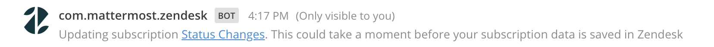
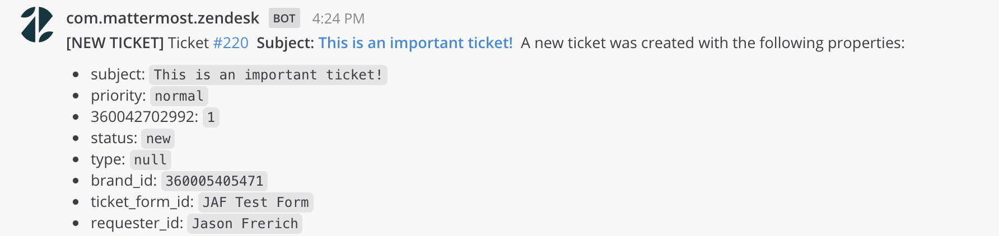
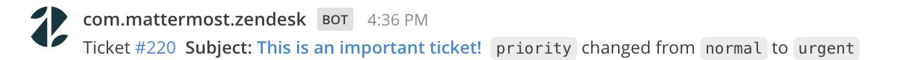

# Zendesk App

**Maintainer:** [@jasonfrerich](https://github.com/jfrerich)

A Zendesk app for Mattermost.

This repository is licensed under the [Apache 2.0 License](https://github.com/mattermost/mattermost-plugin-github/blob/master/LICENSE).

## Table of Contents

- [Admin Guide](#admin-guide)
  - [Prerequisites](#prerequisites)
  - [Setting up](#setting-up)
  - [Notification management](#notification-management)
  - [System Admin slash commands](#system-admin-slash-commands)
- [User's Guide](#users-guide)
  - [Slash commands](#slash-commands)
  - [Create a ticket](#create-a-ticket)
- [Development](#development)
- [Provision](#provision)

## Admin Guide

This guide is intended for Mattermost System Admins setting up the Zendesk app. For more information about contributing to this plugin, visit the [Development section](#development).

### Prerequisites

The Zendesk App is designed using the [Apps Framework](https://developers.mattermost.com/integrate/apps) which differs from the Plugin Framework. You must install and enable the [Mattermost Apps Plugin](https://github.com/mattermost/mattermost-plugin-apps) before Mattermost Apps like the Zendesk App can be installed. You can install the Apps plugin via the Mattermost Marketplace.

### Setting up

To configure and connect Zendesk with Mattermost, follow the steps below.

#### 1. Create a Zendesk OAuth client

Log in to Zendesk as System Admin to create a Zendesk OAuth client for Mattermost.

1. Go to **Zendesk > Admin > API > OAuth Clients**.
1. Select **Add OAuth Client**
    1. `Client Name`: (Example `Mattermost Zendesk App`)
    1. `Description`: `Connect your Zendesk account to Mattermost`
    1. `Redirect URLs`: `https://<mattermost-site-url>/plugins/com.mattermost.apps/apps/zendesk/oauth2/remote/complete`
1. Select **Save**.

#### 2. Install the app in Mattermost

Next, log in to Mattermost as System Admin and run:

`/apps install zendesk`

#### 3. Configure the Zendesk client in Mattermost

In Mattermost, as System Admin, run: `/zendesk configure` to open the configuration modal.

Use the values from the OAuth client set up step:

1. **URL:** Set to your Zendesk URL.
1. **Client ID:** Set to the **Unique identifier** OAuth value.
1. **Client Secret:** Set as the **Secret** OAuth value.

Select **Submit**.

#### 4. Connect your Zendesk account to Mattermost

1. Use `/zendesk connect` to connect your Mattermost user to your Zendesk account.
1. Select the connection link to authenticate your user.
1. Authenticate in Zendesk and close the broweser tab to complete the process.

#### 5. Set up subscriptions

This step requires a Zendesk-connected Mattermost system administrator and uses an access token needed for subscriptions functionality. The token can be any connected Zendesk user with agent permissions in Zendesk. Another option is to create a bot agent user in Zendesk, that will function as a service account, and connect them to Mattermost.

Note, the access token is only used to read ticket information when a subcription is triggered. This token will not post on behalf of the user.

1. `/zendesk setup-target` - This command will set up a Zendesk target pointing to your Mattermost instance (it only needs to be run once).
1. The command also saves the access_token of the acting user for subscriptions functionality.
1. An ephemeral post will confirm that a target was created and that subscriptions functionality has been configured.

## Notification management

Subscriptions to Zendesk events can be added via the channel header or using a slash command. Each subscription creates a [Zendesk Trigger](https://developer.zendesk.com/rest_api/docs/support/triggers). A trigger consists of one or more actions performed when a ticket is created or updated. The actions are performed only if certain conditions are met. For example, a trigger can notify the customer when an agent changes the status of a ticket to Solved.

Triggers send a notification based on specified conditions. Subscriptions currently support the `changed` action on a limited number of fields, but will have enhancements in the future.

Zendesk Admins are able to view these subscriptions inside Zendesk via **Settings > Business Rules > Triggers** and all generated Mattermost Zendesk App Trigger names are prefixed with `__mm_webhook__`. After creating a notification from Mattermost, you can access the trigger in Zendesk and modify conditions of the trigger.

After saving a subscription, an ephemeral confirmation message is posted in Mattermost, with a link that takes you to the trigger in Zendesk. Note that only you will see this ephemeral message.



When you create a subscription for a Mattermost channel, the following message will be posted that shows information about the new ticket.



When a notification for a subscription is received, the Zendesk app posts a message in the channel. The message contains a link to the ticket, the field that changed, and its previous and changed values.



### System Admin slash commands

`/zendesk configure` - Configure the Zendesk app after installation.  
`/zendesk setup-target` - Set up the Zendesk target for your instance. (Requires Zendesk admin permissions)  
`/zendesk subscribe` - Setup a channel subscription. (Requires Zendesk admin permissions)  

## User's Guide

This guide is intended for Mattermost users who want information about the app's functionality, and Mattermost users who want to connect their Zendesk account to Mattermost. Connect your Zendesk account to Mattermost using:

`/zendesk connect`

This slash command connects your Mattermost and Zendesk accounts via OAuth2 authorization.

### Slash commands

`/zendesk connect` - Connect your Zendesk account to Mattermost.  
`/zendesk disconnect` - Disconnect your Zendesk account from Mattermost.  
`/zendesk help` - Post ephemeral message with help text.  

## Create a ticket

Creating a ticket from a Mattermost post is done through the `...` post menu button


## Development

Mattermost Server Setup

To allow the Mattermost server to communicate with a Zendesk cloud instance, your Mattermost instance needs to be exposed to the internet via a tool such as [ngrok.io](https://ngrok.io). The Mattermost server then needs to be configured to use the exposed address. You can set it via **System Console > ENVIRONMENT > Web Server > Site URL**. Then select **Test Live URL** to confirm that the URL is correct. You can also set the `MM_SERVICESETTINGS_SITEURL` environment variable. 

You'll need to restart your Mattermost server after you change the Site URL. 

To install Zendesk in a development environment:

`/apps install http http://localhost:4000/manifest.json`

Start the node server

1. `make watch` - (to monitor typescript errors and watch changing files errors)
1. `make run` - (in a separate shell) start the node server

## Provision

To provision this app to AWS run `make dist` to generate the App bundle and then follow the steps in the [Deployment (AWS)](https://developers.mattermost.com/integrate/apps/deployment-aws) section of the App Developers Preview online documentation.

### Deployment to Heroku

```sh
# Create app in heroku.
heroku login
heroku create
heroku config:set NODE_HOST="heroku url from the previous command's output"

# Deploy app.
# You can be on any branch and run this exact command to deploy your current local commit to heroku
git push -f heroku HEAD:master
```
## Troubleshooting

### Log message received and binding locations do not show

The System Admin has turned off OAuth2 Service Provider. The OAuth2 service needs to be turned on in `config/config.json`:

```json
"EnableOAuthServiceProvider": true,
```

This can also be done in **System Console > Enable OAuth2 Service Provider**.
